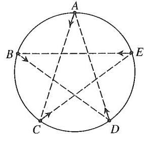

# chasing_kinematics_pre

**中文说明见 `README_zh.md`**

This repository contains the simulation code of multi-points chasing kinematics.

## Problem Description

**This repository discusses Problem 2-10 in Chapter 2 Kinematics from *Textbook for High School Physics Olympiad: Mechanics (2nd ed.)* by Cheng Jiafu.**

As shown in the figure, five particles $A$, $B$, $C$, $D$, and $E$ are located at the five equally spaced positions on a circle of radius $R$ at a certain moment. Assume that each particle moves at a constant speed $v$, and during the motion:

- Particle $A$ always points toward particle $C$,
- Particle $B$ always points toward particle $D$,
- Particle $C$ always points toward particle $E$,
- Particle $D$ always points toward particle $A$,
- Particle $E$ always points toward particle $B$.

Questions:

1) How long does it take from the beginning until all five particles converge at a single point?

2) Particle $A$ moves along a curved path. What is the radius of curvature of this path at the initial moment?

## Instructions

For running the simulation examples, please refer to the `5_points` and `6_points` folders.

For the interactive plot of generic cases (which only the angle between the tangent and radial axis is defined as the parameter), please refer to the `generic_case` folder.

`main.py` is purely decorative for now.

## Requirements

1. Python 3
2. Numpy
3. Matplotlib

We also have MATLAB code for the generic case simulation part.

## Repository Links

[GitHub: tsycstang/chasing_kinematics_pre](https://github.com/tsycstang/chasing_kinematics_pre)

[Gitee: Jonathan Toh/chasing_kinematics_pre](https://gitee.com/tech-navigator-jonathan-toh/chasing_kinematics_pre)

## License

**MIT**